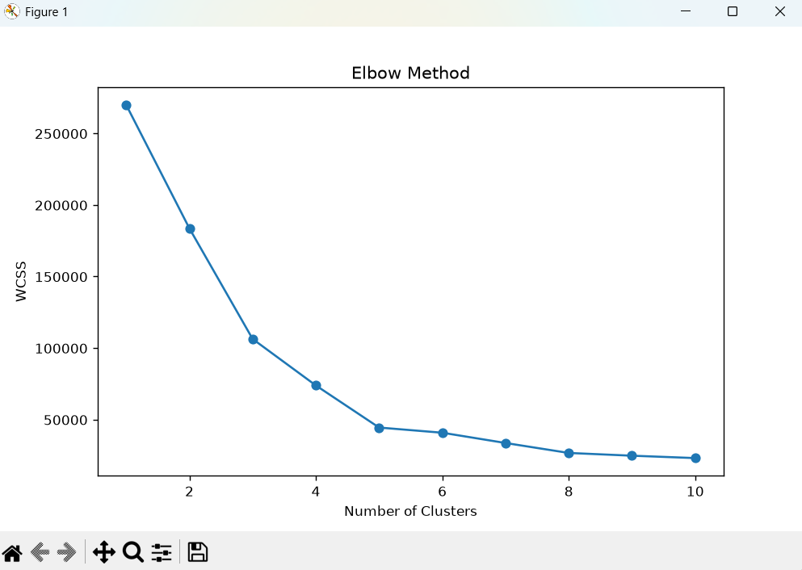
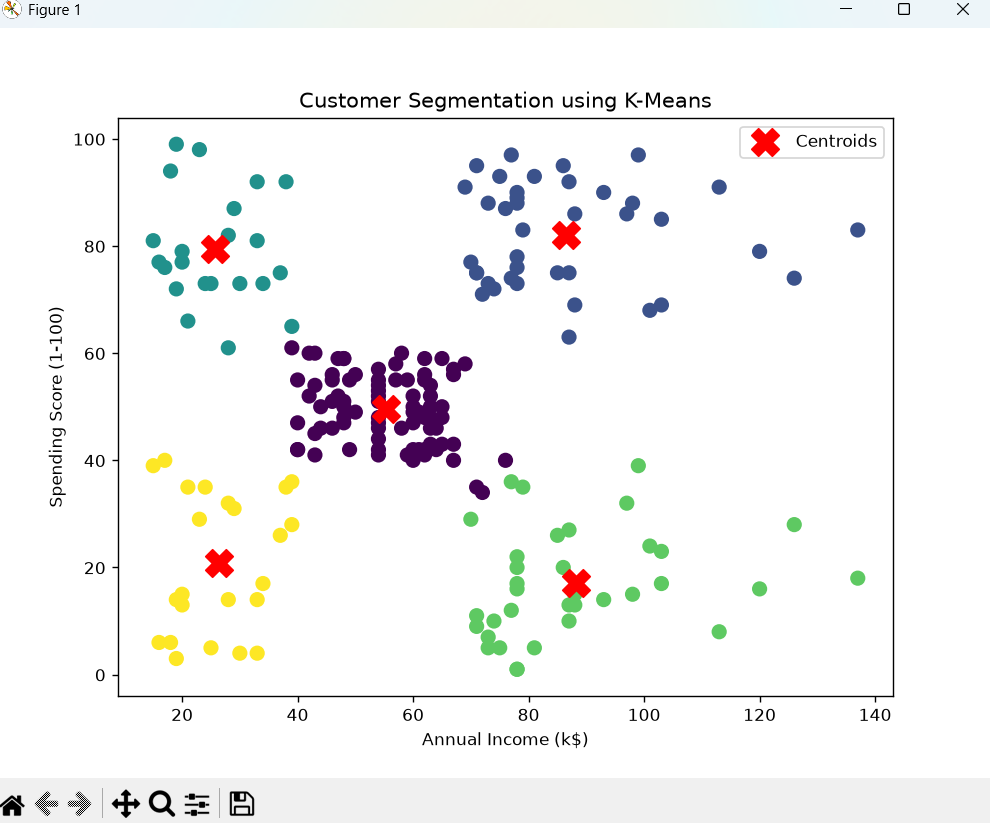
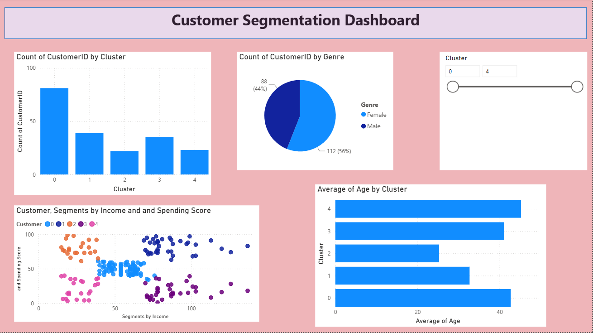

# Customer Segmentation Project

## Overview
This project performs **Customer Segmentation** using the **K-Means Clustering** algorithm to group customers based on their **Annual Income** and **Spending Score**. The results are visualized using both **Python** and **Power BI** to help understand customer behavior and support business decision-making.

---

## Project Objective
- Segment customers into different groups.
- Analyze customer purchasing behavior.
- Identify high-value and low-value customer segments.
- Create an interactive Power BI dashboard for visualization.

---

## Technologies Used
- Python
- Pandas
- NumPy
- Matplotlib
- Scikit-learn
- Power BI Desktop

---

## Dataset
**Mall Customers Dataset**

Features:
- CustomerID
- Gender
- Age
- Annual Income (k$)
- Spending Score (1-100)

---

## Project Workflow

1. Import the dataset
2. Perform data analysis
3. Select features for clustering
4. Use the Elbow Method to determine the optimal number of clusters
5. Apply K-Means Clustering
6. Visualize customer segments
7. Export clustered data
8. Build an interactive Power BI dashboard

---

## Power BI Dashboard
The dashboard includes:
- Customers by Cluster
- Gender Distribution
- Income vs Spending Score (Scatter Plot)
- Average Age by Cluster
- Cluster Slicer

---

## Project Structure

```
Customer_Segmentation_Project/
│
├── dataset/
│   ├── Mall_Customers.csv
│   └── Customer_Segmentation_Result.csv
│
├── main.py
├── Customer_Segmentation_Dashboard.pbix
└── README.md
```

---

## Results
- Successfully segmented customers into **5 clusters** using K-Means.
- Identified different customer groups based on income and spending behavior.
- Built an interactive dashboard for better business insights.

---

## Future Improvements
- Try other clustering algorithms such as DBSCAN or Hierarchical Clustering.
- Add more customer features.
- Deploy the project as a web application using Streamlit.

---

## Author
**Amit Pandey**

GitHub: https://github.com/amitpandey333

## Dashboard Preview
### Elbow Method


### Customer Segmentation (Python)


### Power BI Dashboard


**Amit Pandey**

GitHub: https://github.com/amitpandey333# Customer-Segmentation-Project
